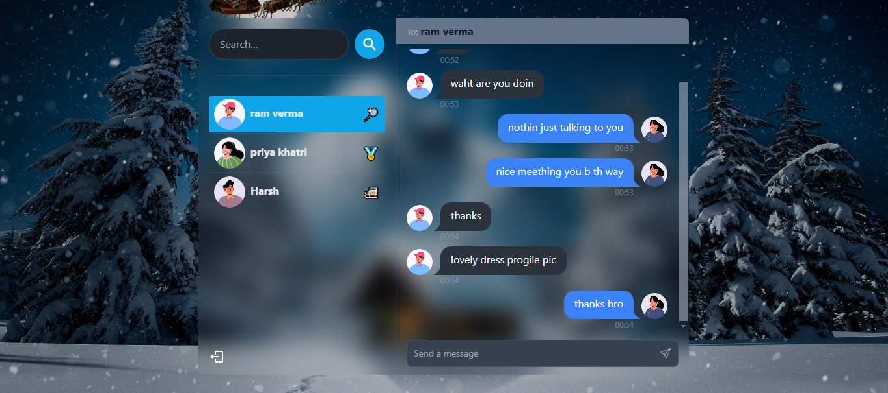

# ✨ Real-Time Chat App: ChatterBox ✨

Created by **Utkarsh Birla** and **Vaishali Ajmera**

## 📊 Project Overview
ChatterBox is a modern real-time chat application built using the MERN stack and enhanced with Socket.io, TailwindCSS, and Daisy UI. This app provides seamless real-time messaging with robust authentication and authorization using JWT.

<!--  -->



## 🔍 Key Features
- **✅ User Authentication**: Secure login/signup with password encryption and session management
- **💬 Real-Time Messaging**: Instant chat for one-on-one and group communication
- **🛡️ Online Status Indicators**: Show when users are active
- **📝 Typing Indicators**: Notify when a user is typing
- **🔒 Message Read Receipts**: Indicate if a message has been read
- **📢 Push Notifications**: Alerts for new messages
- **📄 File Sharing**: Send images, documents, or other files
- **♻️ Message History**: Store and access previous conversations
- **👤 User Profiles**: Customizable user information
- **⌚ Search Functionality**: Locate users, groups, and past chats
- **😍 Emojis and Reactions**: Express yourself with fun interactions

## 🔧 Environment Setup
To run ChatterBox, create a `.env` file in the project root with the following configuration:

```env
PORT=...
MONGO_DB_URI=...
JWT_SECRET=...
NODE_ENV=...
```

## ⚙️ Build the App
To build the application for production, use:

```shell
npm run build
```

## 🚀 Start the App
To start the application:

```shell
npm start
```

🌟 Enjoy building and using **ChatterBox**! 😍

